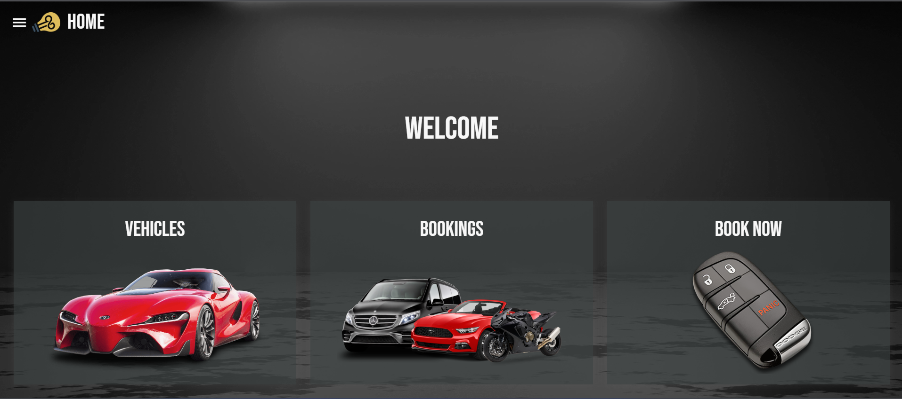
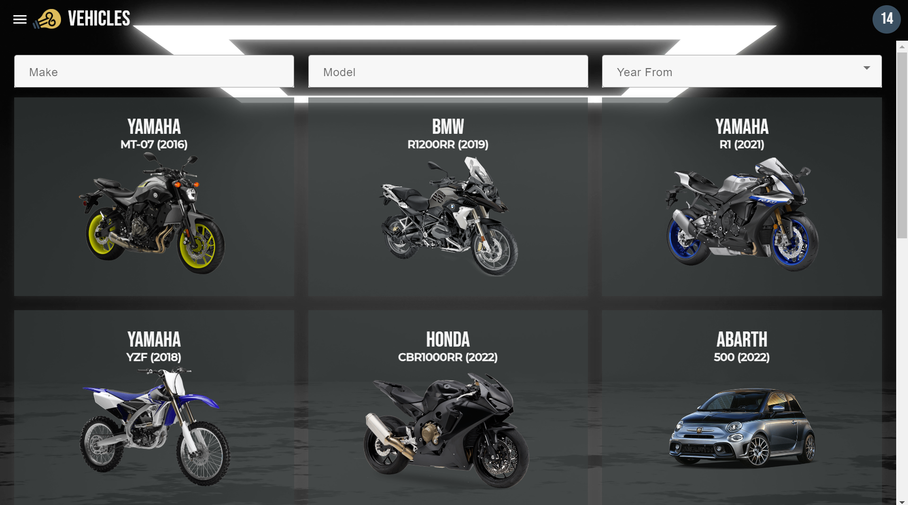
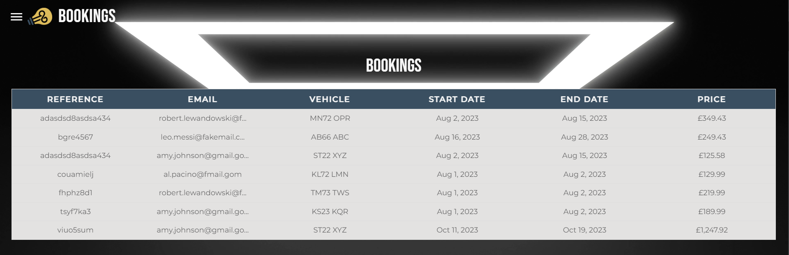
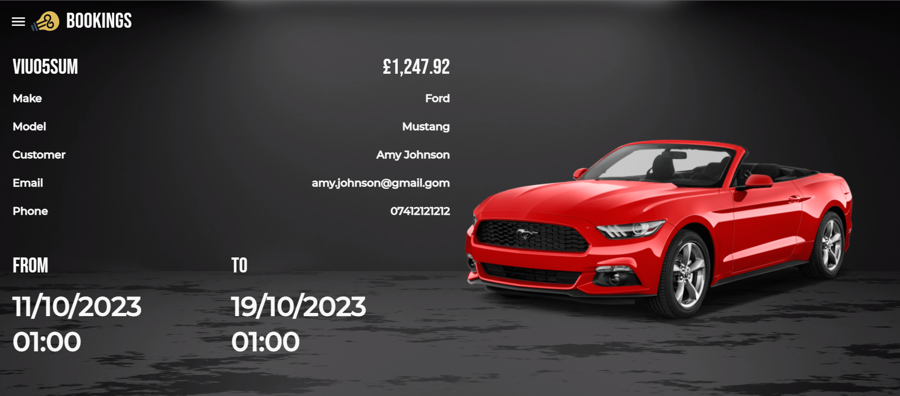

# Car Hire

Welcome to my Car Hire project. Some features are not in working state yet but the plan is to finalise all of them. Enjoy

## Development server

Run `ng serve` for a dev server. Navigate to `http://localhost:4200/`. The app will automatically reload if you change any of the source files.

## User Interface

### Homepage


### Vehicles


### Vehicle


### Bookings


###



## Back-end

I utilised my own back-end infrastructure for this project. This choice was motivated by the fact 
I already had it up and running for my portfolio and I enjoy learning new concepts of NodeJS, Express, MongoDB and Mongoose, 
which I explored and used here.

Below, you can find full implementation of the route used in this project, alongside the schemas generated.
I considered breaking the route down to smaller portions. However, at some point I realised I prefer
to have it on a project level, for easier navigation, etc. 

### Vehicle Booking route

```javascript
require('dotenv').config();
const express = require('express');
const router = express.Router();
module.exports = router;
const dateFns = require('date-fns');
const Vehicles = require('../models/vehicle');
const VehicleBookings = require('../models/vehicle-booking');
const Customers = require('../models/customer');
const {startOfDay, endOfDay, isAfter, isBefore, parseISO, parse} = require("date-fns");
const audience = process.env.AUTH0_AUDIENCE;
const issuer = process.env.ISSUER;

if (!issuer || !audience) {
  throw new Error("Please make sure .env is in place.");
}

/**
 * POST a new customer
 */
router.post(`/customers/`, async (req, res) => {
  const data = new Customers({
    first_name: req.body.first_name,
    last_name: req.body.last_name,
    date_of_birth: parseISO(req.body.date_of_birth),
    email: req.body.email,
    phone: req.body.phone,
    address_1: req.body.address_1,
    address_2: req.body.address_2,
    postcode: req.body.postcode,
    county: req.body.county
  });

  console.log('Data: ', data);

  try {
    const dataToSave = await data.save();
    res.status(200).json(dataToSave);
  } catch (error) {
    res.status(400).json({message: error.message});
  }
});

/**
 * GET all customers
 */
router.get('/customers', async (req, res) => {

  let filtersArray = [];

  if (req.query.name) {
    filtersArray.push({first_name: {$regex: req.query.name, $options: 'i'}});
    filtersArray.push({last_name: {$regex: req.query.name, $options: 'i'}});
  }

  if (req.query.email) {
    filtersArray.push({email: {$regex: req.query.email, $options: 'i'}});
  }

  const filter = filtersArray.length ? {$or: filtersArray} : {};

  try {
    const data = await Customers.find(filter);
    res.json(data);
  } catch (error) {
    res.status(500).json({message: error.message});
  }
});

/**
 * POST a new vehicle booking
 */
router.post(`/vehicle-bookings/`, async (req, res) => {
  const data = new VehicleBookings({
    reference: req.body.reference,
    email: req.body.email,
    vehicle: req.body.vehicle,
    customer: req.body.customer,
    start_date: dateFns.parseISO(req.body.start_date),
    end_date: dateFns.parseISO(req.body.end_date),
    price: req.body.price
  });
  try {
    const dataToSave = await data.save();
    res.status(200).json(dataToSave);
  } catch (error) {
    res.status(400).json({message: error.message});
  }
});

/**
 * GET all vehicle bookings
 */
router.get('/vehicle-bookings', async (req, res) => {
  let filtersArray = [];

  if (req.query.reference) {
    filtersArray.push({reference: {$regex: req.query.reference, $options: 'i'}});
  }

  if (req.query.email) {
    filtersArray.push({email: {$regex: req.query.email, $options: 'i'}});
  }

  const filter = filtersArray.length ? {$or: filtersArray} : {};

  try {
    const data = await VehicleBookings.find(filter);
    res.json(data);
  } catch (error) {
    res.status(500).json({message: error.message});
  }
});

/**
 * GET bookings by id
 */
router.get('/vehicle-bookings/:id', async (req, res) => {
  try {
    const data = await VehicleBookings.findById(req.params.id);
    res.json(data);
  }
  catch(error) {
    res.status(500).json({message: error.message});
  }
});

/**
 * POST a new vehicle
 */
router.post(`/vehicles/`, async (req, res) => {
  const data = new Vehicles({
    make: req.body.make,
    model: req.body.model,
    date_produced: dateFns.parseISO(req.body.date_produced),
    reg: req.body.reg,
    type: req.body.type,
    category: req.body.category,
    capacity: req.body.capacity,
    color: req.body.color,
    picture: 'default',
    day_price: req.body.day_price
  });
  try {
    const dataToSave = await data.save();
    res.status(200).json(dataToSave);
  } catch (error) {
    res.status(400).json({message: error.message});
  }
});


/**
 * GET all vehicles
 */
router.get('/vehicles', async (req, res) => {
  const filters = {};
  let filtersArray = [];

  if (req.query.make) {
    filters.make = req.query.make;
  }

  if (req.query.model) {
    filters.model = req.query.model;
  }

  if (req.query.date_produced) {
    filters.date_produced = {
      $gte: startOfDay(req.query.produced_start),
      $lte: endOfDay(req.query.produced_end)
    }
  }

  if (req.query.type) {
    filters.type = req.query.type;
  }

  if (req.query.category) {
    filters.category = req.query.category;
  }

  if (req.query.capacity) {
    filters.capacity = req.query.capacity;
  }

  if (req.query.make) {
    filtersArray.push({make: {$regex: req.query.make, $options: 'i'}});
  }

  if (req.query.model) {
    filtersArray.push({model: {$regex: req.query.model, $options: 'i'}});
  }

  if (req.query.minyear) {
    filtersArray.push({date_produced: {$gt: new Date(req.query.minyear, 0, 1)}});
  }

  const filter = filtersArray.length ? {$and: filtersArray} : {};

  try {
    const data = await Vehicles.find(filter);
    res.json(data);
  } catch (error) {
    res.status(500).json({message: error.message});
  }
});


/**
 * DELETE booking by id
 */
router.delete(`/vehicle-bookings/:id`, async (req, res) => {
  try {
    const data = await VehicleBookings.findByIdAndDelete(req.params.id);
    res.json(data);
  } catch (error) {
    res.status(500).json({message: error.message});
  }
});

/**
 * DELETE vehicle by id
 */
router.delete(`/vehicles/:id`, async (req, res) => {
  try {
    const data = await Vehicles.findByIdAndDelete(req.params.id);
    res.json(data);
  } catch (error) {
    res.status(500).json({message: error.message});
  }
});

/**
 * Edit booking
 */
router.patch(``, async (req, res) => {
  try {
    let data = await VehicleBookings.findOneAndUpdate(req.params.id);
    res.json(data);
  } catch (error) {
    res.status(500).json({message: error.message});
  }
});

/**
 * GET all available vehicles
 */
router.get('/vehicle-availability', async (req, res) => {
  let filters = {};
  let availableVehicles = [];
  filters.start_date = req.query.start_date;
  filters.end_date = req.query.end_date;
  try {
    const bookings = await VehicleBookings.find();
    let vehicles = await Vehicles.find();
    let vehiclesBooked = [];
    let vehiclesFiltered;

    for (let item of bookings) {

      if ((isAfter(parseISO(filters.start_date), item.start_date) && isBefore(parseISO(filters.start_date), item.end_date)) ||
        (isAfter(parseISO(filters.end_date), item.start_date) && isBefore(parseISO(filters.end_date), item.end_date))) {
        console.log('Booked: ', item.vehicle._id.toString());
        vehiclesBooked.push(item.vehicle._id.toString());
      }
    }

    if (vehicles && vehicles.length) {
      if (vehiclesBooked.length) {
        vehiclesBooked.forEach(el => {
          vehiclesFiltered = vehicles.filter(vEl => {
            return vEl._id.toString() !== el;
          })
        });
      } else {
        vehiclesFiltered = [...vehicles];
      }
    }
    res.json(vehiclesFiltered);
  } catch (error) {
    res.status(500).json({message: error.message});
  }
});


```

### Vehicle Booking Schema

```javascript
const mongoose = require('mongoose');
const {Schema} = require("mongoose");
const {ObjectId} = require("mongodb");

const VehicleBookingSchema = new mongoose.Schema({
  reference: {
    type: String,
    required: true
  },
  email: {
    type: String,
    required: true
  },
  vehicle: {
    type: Object,
    required: true
  },
  customer: {
    type: Object,
    required: true
  },
  start_date: {
    type: Date,
    default: Date.now,
    required: true
  },
  end_date: {
    type: Date,
    default: Date.now,
    required: true
  },
  price: {
    type: Number,
    required: true
  },
});

module.exports = mongoose.model('VehicleBookings', VehicleBookingSchema);

```

### Vehicle Schema

```javascript
//     "color": "red",
//     "price": "10000$",
//     "year": 2010,
//     "seats": 2,
//     "category": "car",
//     "image": "test"

const mongoose = require('mongoose');
const {Schema} = require("mongoose");
const {ObjectId} = require("mongodb");

const VehicleSchema = new mongoose.Schema({
  make: {
    type: String,
    required: true
  },
  model: {
    type: String,
    required: true
  },
  date_produced: {
    type: Date,
    default: Date.now,
    required: true
  },
  reg: {
    type: String,
    required: true
  },
  type: {
    type: String, // car / van / motorcycle
    required: true
  },
  category: {
    type: String, // sports / convertible / carrier / hatchback / suv / adventure / naked / super sports
    required: true
  },
  capacity: {
    type: Number,
    required: false
  },
  color: {
    type: String,
    required: false
  },
  day_price: {
    type: Number,
    required: true
  },
  picture: {
    type: String,
    required: true
  },
});

module.exports = mongoose.model('Vehicles', VehicleSchema);

```

### Customer Schema
```javascript
const mongoose = require('mongoose');
const {Schema} = require("mongoose");
const {ObjectID, ObjectId} = require("mongodb");

const CustomerSchema = new mongoose.Schema({
  first_name: {
    type: String,
    required: true
  },
  last_name: {
    type: String,
    required: true
  },
  date_of_birth: {
    type: Date,
    required: true
  },
  email: {
    type: String,
    required: true
  },
  phone: {
    type: String,
    required: true
  },
  address_1: {
    type: String,
    required: true
  },
  address_2: {
    type: String,
    required: false
  },
  postcode: {
    type: String,
    required: true
  },
  county: {
    type: String,
    required: false
  }
});

module.exports = mongoose.model('Customers', CustomerSchema);

```


